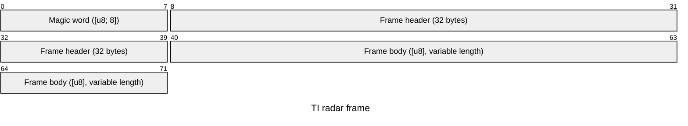
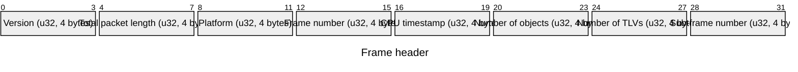
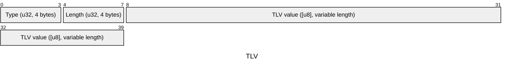

# titlv

`titlv` decodes Type-Length-Value (TLV) frames emitted by Texas Instruments
mmWave radar sensors, including IWR6843 and IWR1443 devices.

## Add the dependency

Add `titlv` to your `Cargo.toml`:

```toml
[dependencies]
titlv = "0.1.0"
```

For a local checkout, use a path dependency instead:

```toml
[dependencies]
titlv = { path = "../titlv-rs" }
```

## Read frames

Wrap the radar byte stream in a `BufReader`, construct a `FrameStreamReader`,
and read frames as `StandardTlv`. The reader skips bytes before a frame's magic
word and returns `None` at end of stream.

```no_run
use std::{fs::File, io::BufReader};

use titlv::prelude::*;

fn main() -> Result<()> {
    let file = File::open("radar.bin")?;
    let mut reader = FrameStreamReader::new(BufReader::new(file));

    while let Some(frame) = reader.read_frame::<StandardTlv>()? {
        println!(
            "frame {}: {} supported TLVs",
            frame.header.frame_number,
            frame.payload.len(),
        );

        for tlv in frame.payload {
            match tlv {
                StandardTlv::PointCloud(cloud) => {
                    for point in cloud.points {
                        println!("x={}, y={}, z={}, doppler={}", point.x, point.y, point.z, point.doppler);
                    }
                }
                StandardTlv::ExtendedPointCloud(cloud) => {
                    println!("{} extended points", cloud.points.len());
                }
            }
        }
    }

    Ok(())
}
```

`FrameStreamReader` preserves its position between calls. Each returned frame
has a [`FrameHeader`](https://docs.rs/titlv/latest/titlv/types/struct.FrameHeader.html)
and a payload containing decoded TLVs. Unsupported TLVs are skipped when using
`StandardTlv`.

## Frame format

> **Note:** All packet lengths are in bytes.
> The primitives are encoded in little-endian format.

A frame starts with the magic word, followed by its header and body.



The body begins at byte 40 and has a variable length.



All header fields are little-endian 32-bit values.



Each TLV begins with an 8-byte header followed by its variable-length value.

## Custom TLVs

Derive `TlvReader` for a payload with fields in wire order. Derive `Tlv` and
provide the TI TLV type ID to validate the packet header before decoding.

```rust
use titlv::prelude::*;

#[derive(TlvReader)]
struct Temperature {
    degrees_celsius: f32,
}

#[derive(Tlv)]
#[tlv(type = 42)]
struct TemperatureTlv {
    degrees_celsius: f32,
}
```

Use the traits directly when the TLV type is known:

```rust,ignore
let temperature = TemperatureTlv::from_packet(packet)?;
```

## Errors

The crate returns `Result<T, TlvError>`. I/O failures, malformed packet data,
and unexpected TLV type IDs are reported as `TlvError` values.
